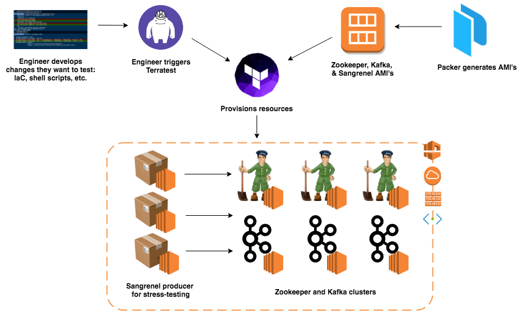

# 🌀 Tower of Terra 🌀

Making Infrastructure Changes Safer With Terraform & Terratest ([Slides](https://docs.google.com/presentation/d/11J1HlO_GscNaYbUTNd59462zI9EwuFxsRMEliNSkl6Y/edit?usp=sharing))

## Introduction

Infrastructure as code (IaC) tools have unlocked numerous powerful benefits both technical and operational, such as automating provisioning and deployment processes or having the ability to easily track infrastructure changes over time within version control.

However, writing and maintaining infrastructure code can still be as tricky as writing other code. As [Gruntwork](https://www.gruntwork.io/) co-founder Yevgeniy Brikman points out:

> Most IaC tools are immature, modern architectures are complicated, and seemingly minor changes to infrastructure code sometimes cause severe bugs, such as wiping out a server, a database, or even an entire data center.
>
> *Here’s the hard truth: most teams are terrified of making changes to their infrastructure code.*

It's easy to see why changing infrastructure code can be frightening. As mentioned above, one false setting around provisioning and/or configuration management can result in a catastrophe if it reaches production. Even if we manage to deploy our infrastructure without errors, there's still a lingering fear that the overall system design might have problems that have yet to be identified (e.g., scalability issues when ingesting larger data volumes). Whether you're a large financial institution dealing with OLTP pipelines or a fledgling startup just starting to build its MVP, your infrastructure is the foundation of your organization's tech stack, and assuring its reliability is critical.

This is where a tool like [Terratest](https://github.com/gruntwork-io/terratest) comes to the rescue. Terratest is a library that makes it easier to develop tests for infrastructure code, enabling us to run IaC tools against real servers and other infrastructure in a real environment such as AWS or Google Cloud.

The goal of this project is both an exercise in creating infrastructure (e.g., successfully configuring Zookeeper and Kafka brokers) as well as establishing the groundwork for automatically testing that infrastructure (and any potential changes to it) using Terratest.

## Infrastructure & Tools

- **Terraform** for provisioning infrastructure.

- **Packer** for creating base AMI's.

- **Kakfa & Apache Zookeeper** clusters on **EC2**.

- [**Sangrenel**](https://github.com/jamiealquiza/sangrenel) workers on **EC2**. Sangrenel is a stress-test library that serves as our producers.

- **Terratest** library for writing & conducting automated infrastructure tests.

## Primary engineering challenges
- The ability to deploy our entire infrastructure by simply running `terraform apply` — a vital step for our automated, transient infrastructure testing.
- Configuring Zookeeper via Terraform. At its core, Terraform tries to parallelize infrastructure creation as much as possible; this can cause issues with Zookeeper, in which each server in the cluster needs to be sequentially instantiated in ascending order of id. To address this, I created a `null_resource` that waited on the Zookeeper instances to be created — when they were ready, the `null_resource` was responsible for initializing the Zookeeper instances in sequential order.

## Future Improvements
- **More sophisticated tests:** This project lays the foundation for doing more complicated tests against more complicated infrastructure changes. E.g., a test that not only validates that autoscaling groups and launch configurations are created correctly, but that they respond as expected (i.e. fall below specified utilization thresholds) to certain loads from our stress-test workers.
- **Include test as part of CI/CD workflow**: It could be interesting to experiment with tests of varying fidelity if run from an operator's environment vs a staging environment — e.g., when running Terratest from our personal machines, our producers could be generate random bytes, but our staging environment could pull from actual data sources.
- **Proper handling of Terraform State**: Terraform state is straightforward when there is only one operator making changes, but things give unruly as more operators contribute and apply their infrastructure changes. Related to the previous point, it would be an interesting exercise to integrate something like [Terragrunt](https://github.com/gruntwork-io/terragrunt) or [Atlantis](https://www.runatlantis.io/) to simulate a process that would more accurately reflect a real team's workflow.

---

Insight DevOps Engineering Project (Class 2018C)
